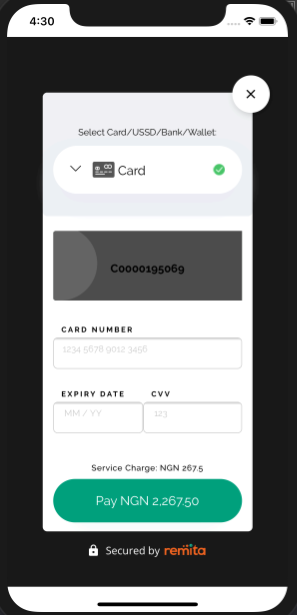

# Remita Flutter Payment

This is a package that helps you accept payment using [Remita Payment Gateway](https://www.remita.net/) in your flutter application.



## Requirements

1. Remita [API Keys](https://api.remita.net/#63394d54-96c1-4dd8-8255-51e9a55e16df)
2. Supported Flutter version >= 1.17.0

## Installation

1. Add the dependency to your project. In your `pubspec.yaml` file add: `Remita_flutter_inline: 1.0.0`
2. Run `flutter pub get`

## Usage

### Initializing a RemitaPayment instance

To create an instance, you should call the RemitaInlinePayment constructor with the following as parameters:

-   `BuildContext`
-   `PaymentRequest`
-   `Customizer`

It returns an instance of RemitaInlinePayment
with this instance, we then call the async method `.initiatePayment()`.

    _handlePayment() async {

        PaymentRequest request = PaymentRequest(
            environment: RemitaEnvironment.demo,
            rrr: 'pass your rrr here',
            key: 'enter your key here',
        );

        RemitaPayment Remita = RemitaInlinePayment(
            buildContext: context,
            paymentRequest: request,
            customizer: Customizer(),
        );

        PaymentResponse response = await Remita.initiatePayment();

    }

### Handling the response

Calling `.initiatePayment()` method returns a Future of `PaymentResponse`.

    PaymentResponse response = await Remita.initiatePayment();
    if (response.code != null && response.code == '00') {
      // transaction successful
      // verify transaction status before providing value
    } else {

    }

### TEST CARDS

```json
    CARD: 5178 6810 0000 0002,
    Expire Date : 05/30,
    CCV: 000,
    OTP: 123456
```

## Tools Used

-   [flutter](https://flutter.dev/)
-   [flutter_inappwebview](https://pub.dev/packages/flutter_inappwebview)

## License

By contributing to the Flutter library, you agree that your contributions will be licensed under its [MIT license](/LICENSE).

## Author

-   [James Aworo](https://jamesaworo.com)
